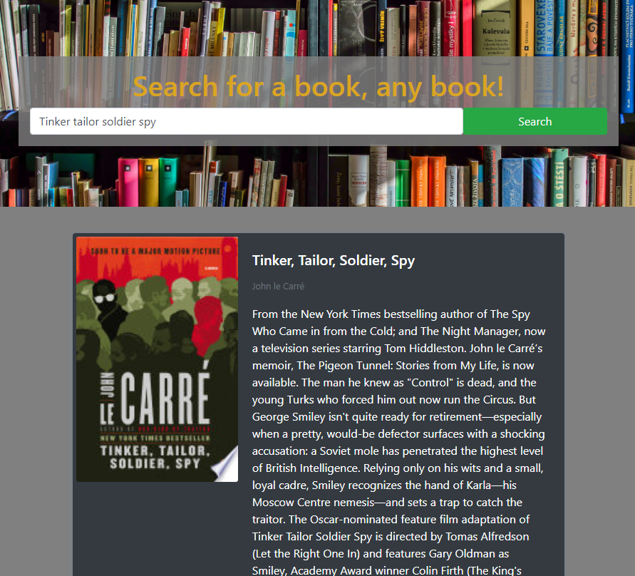
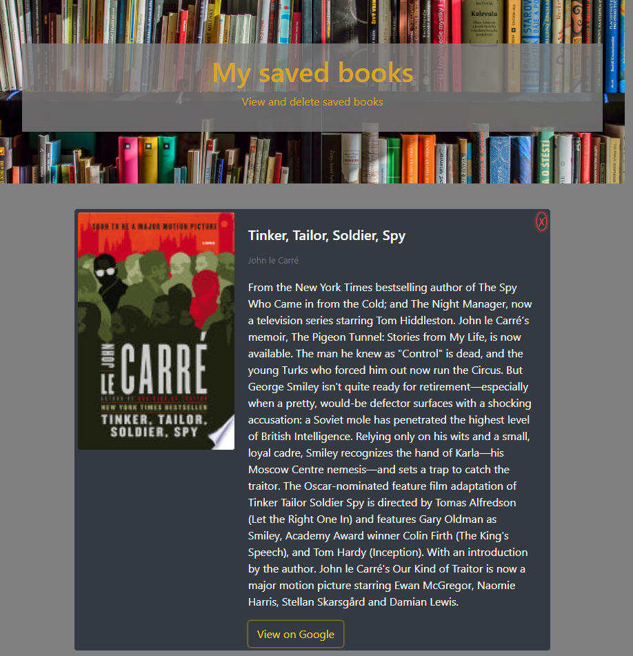

# Book search

## Description
  
This is a MERN stack application utilising the Google Books API and allowing the user to save favourite books to the database. The application is [deployed here to Heroku](https://mhgooglebooks.herokuapp.com/).
  
## Table of Contents
  
* [Description](#description)
* [Installation](#installation)
* [Usage](#usage)
* [License](#license)
* [Contributing](#contributing)
* [Tests](#tests)
* [Questions](#questions)
  
## Installation
  
There are no project specific installation instructions to provide. This is a MERN stack application, which requires a connection with a MongoDB database and can be started by running 'npm start'.
  
## Usage
  
AS an avid reader of books 
I want to be able to search for books based on key words 
SO THAT I can then save them in a reading list for future reference.

A Screenshot of the search page is here:

A screenshot of the saved books list is here:

  
## License
  
The application is released under the MIT license.
  
## Contributing
  
To contribute to this application, create a pull request. Here are the steps needed for doing that:

* Fork the repo
* Create a feature branch (git checkout -b NAME-HERE)
* Commit your new feature (git commit -m 'Add some feature')
* Push your branch (git push)
* Create a new Pull Request
        
Following a code review, your feature will be merged.
  
## Tests
  
There are no project specific tests provided.
  
## Questions
  
Link to author's [gitHub profile](https://github.com/maria-helbling).
  
In case of further questions, e-mail: 
